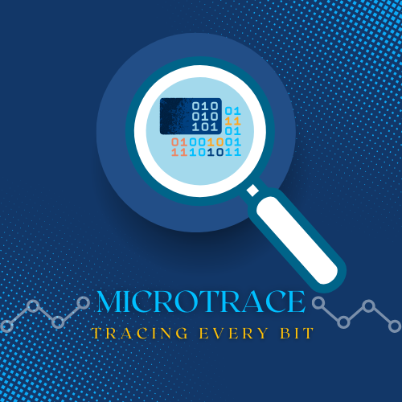

<<<<<<< HEAD
# microtrace-mcp
=======
# ⚡ MicroTrace – Automated SBOM Extractor for Embedded Binaries

> _An intelligent system for firmware reverse engineering, component classification, and vulnerability analysis._

---

  

---

## Table of Contents

- [Project Overview](#-project-overview)
- [Project Phases](#-project-phases)
  - [Phase 1 – SBOM Extraction and Visualization](#phase-1--sbom-extraction-and-visualization)
  - [Phase 2 – AI-Driven Analysis and Vulnerability Detection](#phase-2--ai-driven-analysis-and-vulnerability-detection)
- [Key Technologies](#-key-technologies)
- [Time Plan](#-time-plan)
- [Final Outcomes](#-final-outcomes)
- [Use Cases](#️-use-cases)

---

## Project Overview

**MicroTrace** is a research and development project that aims to automatically generate a **Software Bill of Materials (SBOM)** from **bare-metal embedded firmware**.  
By reverse-engineering binaries and analyzing function patterns, MicroTrace identifies different software layers—such as **MCAL**, **HAL**, **Middleware**, and **Application logic**—and presents them through an **interactive web visualization**.

The project bridges reverse engineering, AI, and cybersecurity to improve **firmware transparency**, **vulnerability detection**, and **supply chain security**.

---

## Project Phases

### **Phase 1 – SBOM Extraction and Visualization**

#### 🎯 Goal

Build an automated pipeline that extracts functions from a firmware binary, classifies them into layers, and visualizes the architecture as an interactive graph.

#### Workflow

1. **Input:**

   - Upload a `.elf` or `.bin` or `.axf` firmware file.

2. **Disassembly & Function Extraction:**

   - Process the binary using **Ghidra Headless** to extract functions, symbols, and call relationships.
   - Export results in structured JSON for analysis.

3. **Component Classification (YARA):**

   - Apply **YARA rules** to detect:
     - **MCAL functions** — low-level register access and peripheral control.
     - **HAL functions** — wrappers around MCAL or hardware abstraction.
     - **Main/Application logic** — functions unmatched to known libraries.

4. **Frontend Visualization:**

   - Display results on a **web-based Node Graph**:
     - Nodes = Functions or modules
     - Edges = Function calls or dependencies
     - Colors = Software layers (MCAL, HAL, Middleware, Application)

5. **RAG Assistant Integration:**
   - Use **Retrieval-Augmented Generation (RAG)** connected to **ARM datasheets**.
   - Users can ask natural-language questions about hardware registers or function purposes.

#### 📦 Deliverables

- Automated disassembly backend (Ghidra + scripts)
- YARA-based classification system
- AI datasheet assistant prototype
- Web UI for function visualization

---

### **Phase 2 – AI-Driven Analysis and Vulnerability Detection**

#### 🎯 Goal

Use machine learning and vulnerability data to identify unknown functions, detect reused libraries, and flag potential security risks.

#### Workflow

1. **AI-Based Function Mapping:**

   - Apply **function fingerprinting** to unknown (HAL/Application) code.
   - Match against a database of known middleware/libraries (e.g., FreeRTOS, lwIP, CMSIS DSP).

2. **Vulnerability Detection:**

   - Cross-check identified libraries with **CVE databases** (e.g., NVD).
   - Alert users to known vulnerabilities and suggest mitigations.
   - Generate a structured **SBOM** (SPDX or CycloneDX).

3. **Plagiarism & Similarity Analysis:**
   - Compare function fingerprints across firmware samples to detect **code reuse** or **intellectual property violations**.

#### 📦 Deliverables

- AI-based library and function classifier
- CVE lookup and vulnerability reporting module
- SPDX/CycloneDX SBOM exporter
- Enhanced dashboard with alerts and recommendations

---

## Key Technologies

| Component                   | Tool / Framework                   | Purpose                            |
| --------------------------- | ---------------------------------- | ---------------------------------- |
| **Disassembly & Analysis**  | Ghidra Headless, Capstone, Radare2 | Extract functions and instructions |
| **Pattern Matching**        | YARA                               | Detect known MCAL/HAL code         |
| **AI Assistant (RAG)**      | LangChain / LlamaIndex             | Query hardware datasheets          |
| **Frontend Visualization**  | React + D3.js / Cytoscape.js       | Interactive function graph         |
| **Vulnerability Detection** | NVD API / CVE Feeds                | Check known CVEs                   |
| **SBOM Format**             | SPDX / CycloneDX                   | Standardized compliance reports    |

---

## 📅 Time Plan

| Phase          | Duration               | Milestones                                                 |
| -------------- | ---------------------- | ---------------------------------------------------------- |
| **Week 1–2**   | Setup                  | Team repo, architecture design, sample firmware collection |
| **Week 3–5**   | Disassembly            | Automate Ghidra headless extraction and JSON output        |
| **Week 6–8**   | Classification         | Develop and test YARA rules for MCAL/HAL                   |
| **Week 9–10**  | Visualization          | Implement frontend graph with live data                    |
| **Week 11–12** | RAG Assistant          | Embed ARM datasheets and test AI queries                   |
| **Week 13–14** | Fingerprinting         | Train/test AI model for unknown functions                  |
| **Week 15–17** | Vulnerability Analysis | CVE lookup integration + SBOM report export                |
| **Week 18+**   | Final Integration      | System testing, polish frontend, finalize docs             |

---

## Final Outcomes

- Automated **SBOM extractor** for embedded binaries
- Interactive **code architecture graph**
- **AI assistant** for hardware and logic understanding
- Integrated **vulnerability and compliance scanner**
- Optional **code similarity / plagiarism detection**

---

## Use Cases

- **Firmware Security Auditing** — Identify vulnerabilities in IoT or industrial firmware
- **Supply Chain Verification** — Ensure third-party components are trusted
- **Reverse Engineering** — Explore firmware structure and dependencies
- **Educational Use** — Visualize embedded software layers for students
- **IP Protection** — Detect copied or reused embedded code

---

🔹 <b>MicroTrace</b> — Bridging Embedded Systems, Security, and AI 🔹

<!-- 
🔹 <b>MicroTrace</b> — Tracing Every Bit 🔹
 -->
>>>>>>> c7b1762 (first commit)
